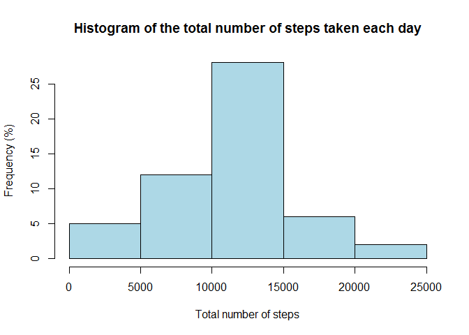
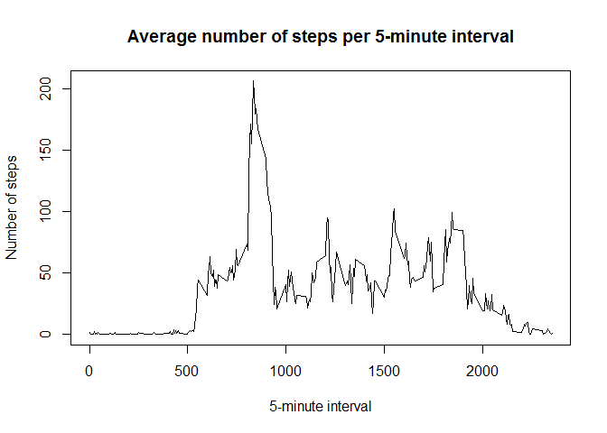
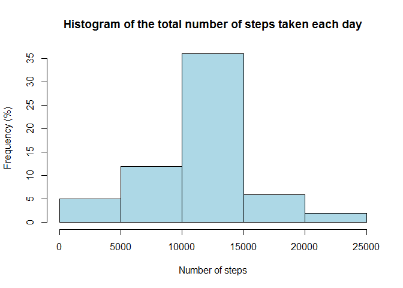
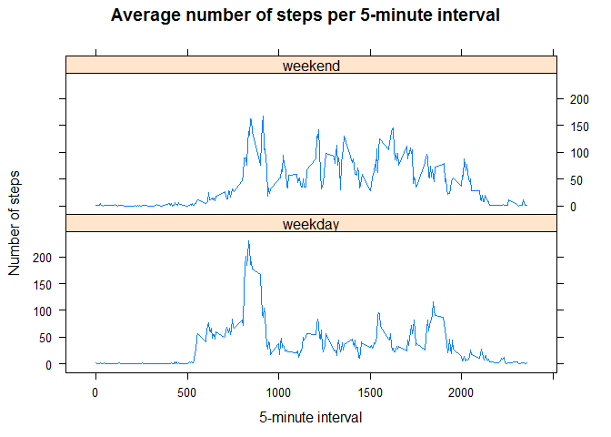

# Reproducible Research: Peer Assessment 1

# Introduction

It is now possible to collect a large amount of data about personal movement
using activity monitoring devices such as a [Fitbit](http://www.fitbit.com),
[Nike Fuelband](http://www.nike.com/us/en_us/c/nikeplus-fuelband), or
[Jawbone Up](https://jawbone.com/up). These type of devices are part of the
"quantified self" movement -- a group of enthusiasts who take measurements about 
themselves regularly to improve their health, to find patterns in their behavior
, or because they are tech geeks. But these data remain under-utilized both 
because the raw data are hard to obtain and there is a lack of statistical 
methods and software for processing and interpreting the data.

This assignment makes use of data from a personal activity monitoring device.
This device collects data at 5 minute intervals through out the day. The data 
consists of two months of data from an anonymous individual collected during the
months of October and November, 2012 and include the number of steps taken in 5 
minute intervals each day.

# Data

The data for this assignment can be downloaded from the course web site:

* Dataset: [Activity monitoring data](https://d396qusza40orc.cloudfront.net/repdata%2Fdata%2Factivity.zip) [52K]

The variables included in this dataset are:

* **steps**: Number of steps taking in a 5-minute interval (missing values are 
coded as `NA`)

* **date**: The date on which the measurement was taken in YYYY-MM-DD format

* **interval**: Identifier for the 5-minute interval in which measurement was 
taken

The dataset is stored in a comma-separated-value (CSV) file and there are a 
total of 17,568 observations in this dataset.

# Assignment

This assignment will be described in multiple parts. You will need to write a 
report that answers the questions detailed below. Ultimately, you will need to 
complete the entire assignment in a **single R markdown** document that can be 
processed by **knitr** and be transformed into an HTML file.

Throughout your report make sure you always include the code that you used to 
generate the output you present. When writing code chunks in the R markdown 
document, always use `echo = TRUE` so that someone else will be able to read 
the code. **This assignment will be evaluated via peer assessment so it is 
essential that your peer evaluators be able to review the code for your 
analysis**.

For the plotting aspects of this assignment, feel free to use any plotting 
system in R (i.e., base, lattice, ggplot2)

Fork/clone the [GitHub repository created for this assignment](http://github.com/rdpeng/RepData_PeerAssessment1). You will submit 
this assignment by pushing your completed files into your forked repository on 
GitHub. The assignment submission will consist of the URL to your GitHub 
repository and the SHA-1 commit ID for your repository state.

NOTE: The GitHub repository also contains the dataset for the assignment so you 
do not have to download the data separately.


## Loading and preprocessing the data

Show any code that is needed to

1. Load the data (i.e. `read.csv()`)

2. Process/transform the data (if necessary) into a format suitable for your analysis


```r
# Unzip the file
unzip("activity.zip", "activity.csv")
# Read the csv dataset in a dataframe with the right class for each variable
activity <- read.csv("activity.csv", header = TRUE,
                     colClasses = c("integer","Date","integer"))
```

## What is mean total number of steps taken per day?

For this part of the assignment, you can ignore the missing values in the 
dataset.

1. Calculate the total number of steps taken per day


```r
totalPerDay <- aggregate(steps ~ date, data = activity, sum)
```
        
2. If you do not understand the difference between a histogram and a barplot, 
research the difference between them. Make a histogram of the total number of 
steps taken each day


```r
hist(totalPerDay$steps, col = "lightblue", 
     main = "Histogram of the total number of steps taken each day",
     xlab = "Total number of steps",
     ylab = "Frequency (%)")
```

 

3. Calculate and report the **mean** and **median** of the total number of steps taken 
per day


```r
meanTotalStepsPerDay   <- as.integer(round(mean(totalPerDay$steps)))
medianTotalStepsPerDay <- as.integer(round(median(totalPerDay$steps)))
cat("Statistics about the total number of steps taken per day: \n",
    "mean  :", meanTotalStepsPerDay, "\n",
    "median:", medianTotalStepsPerDay)
```

```
## Statistics about the total number of steps taken per day: 
##  mean  : 10766 
##  median: 10765
```

## What is the average daily activity pattern?

1. Make a time series plot (i.e. `type = "l"`) of the 5-minute interval (x-axis) 
and the average number of steps taken, averaged across all days (y-axis)


```r
averagePerInterval <- aggregate(steps ~ interval, data = activity, mean)
plot(averagePerInterval$interval, averagePerInterval$steps, type = "l",
     main = "Average number of steps per 5-minute interval",
     xlab = "5-minute interval", ylab = "Number of steps")
```

 

2. Which 5-minute interval, on average across all the days in the dataset, 
contains the maximum number of steps?


```r
cat("5-minute interval, on average across all the days in the dataset, which contains the maximum number of steps: ",
    averagePerInterval$interval[
        which(averagePerInterval$steps == max(averagePerInterval$steps))])
```

```
## 5-minute interval, on average across all the days in the dataset, which contains the maximum number of steps:  835
```

## Imputing missing values

Note that there are a number of days/intervals where there are missing values 
(coded as `NA`). The presence of missing days may introduce bias into some 
calculations or summaries of the data.

1. Calculate and report the total number of missing values in the dataset (i.e. 
the total number of rows with `NA`s)


```r
cat("Total number of missing values in the dataset (i.e. total number of rows with NAs):",
    sum(complete.cases(activity)==FALSE))
```

```
## Total number of missing values in the dataset (i.e. total number of rows with NAs): 2304
```

2. Devise a strategy for filling in all of the missing values in the dataset. 
The strategy does not need to be sophisticated. For example, you could use the 
mean/median for that day, or the mean for that 5-minute interval, etc.

**My strategy: replace missing number of steps in a 5-minute interval by the 
mean for that 5-minute interval**

3. Create a new dataset that is equal to the original dataset but with the 
missing data filled in.


```r
# Create a copy of the initial data set
activity2 <- activity
# Replace missing number of steps in a 5-minute interval by the mean of number of steps for that 5-minute interval
for (i in 1:nrow(activity2)){
        if(is.na(activity2$steps[i])){
                activity2$steps[i] <- averagePerInterval$steps[
                        averagePerInterval$interval==activity2$interval[i]]
        }
}
```

4. Make a histogram of the total number of steps taken each day:


```r
totalPerDay2 <- aggregate(steps ~ date, data = activity2, sum)
hist(totalPerDay2$steps, col = "lightblue", 
     main = "Histogram of the total number of steps taken each day",
     xlab = "Number of steps",
     ylab = "Frequency (%)")
```

 

Calculate and report the **mean** and **median** total number of steps taken per 
day.


```r
meanTotalStepsPerDay2   <- as.integer(round(mean(totalPerDay2$steps)))
medianTotalStepsPerDay2 <- as.integer(round(median(totalPerDay2$steps)))
cat("Statistics about the total number of steps taken per day: \n",
    "mean  :",meanTotalStepsPerDay2,"\n",
    "median:",medianTotalStepsPerDay2)
```

```
## Statistics about the total number of steps taken per day: 
##  mean  : 10766 
##  median: 10766
```

Do these values differ from the estimates from the first part of the assignment?
What is the impact of imputing missing data on the estimates of the total daily 
number of steps?

**My answer: The mean and median values do not really differ from the estimates 
from the first part of the assignment. In fact most of the missing values are 
concentrated on particular dates which have no recorded number of steps at all.
Then in the first part, the mean and total number of steps taken per day are 
calculated without these "blank" dates. 
Replacing missing data in "blank" dates by the mean of non-missing data will not
affect the overall mean and median because we just add data in the center of the 
poulation. The very little difference is due to the impact of replacing missing 
data in dates that are not totally "blank" but have some number of steps 
recorded for some intervals.**

## Are there differences in activity patterns between weekdays and weekends?

For this part the `weekdays()` function may be of some help here. Use the 
dataset with the filled-in missing values for this part.

1. Create a new factor variable in the dataset with two levels - "weekday" and 
"weekend" indicating whether a given date is a weekday or weekend day.


```r
# Create a function that return the "day"" of a date: "weekday" or "weekend day"
dateToDayFunction <- function(date){
        weekday <- c("Monday", "Tuesday", "Wednesday", "Thursday", "Friday")
        if(weekdays(date) %in% weekday) {
                day <- "weekday"
        } else {
                day <- "weekend"
        }
        return(day)
}
# Use this function to create, from the "date" variable in the dataset, a new 
# factor variable "day" 
activity2$day <- as.factor(sapply(activity2$date, dateToDayFunction))
```

2. Make a panel plot containing a time series plot (i.e. `type = "l"`) of the 
5-minute interval (x-axis) and the average number of steps taken, averaged 
across all weekday days or weekend days (y-axis). See the README file in the 
GitHub repository to see an example of what this plot should look like using 
simulated data.


```r
# Create a new dataset by averaging the number of steps aggregated by "day" and interval
activity3 <- aggregate(steps ~ day + interval, data = activity2 , mean) 
# Use the lattice plotting system to make the requested panel plot
require(lattice)
```

```
## Loading required package: lattice
```

```r
xyplot(steps~interval|day, data=activity3, type = "l", layout=c(1,2),
       main="Average number of steps per 5-minute interval",
       xlab="5-minute interval", ylab="Number of steps")
```

 
